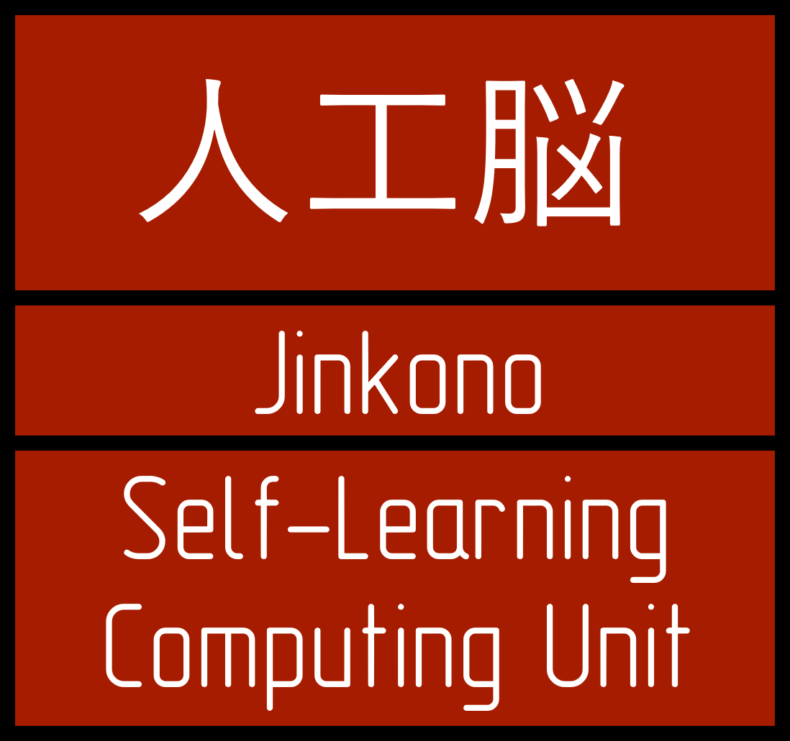

# 人工脳

Jinkono is a self-learning FPGA-based computing unit designed for installation in autonomous robotic platforms.

Conceptually, each FPGA module is an independent part of the computing system, has RAM and the corresponding amount of non-volatile memory to implement the neural network structure and store it. I also plan to use the MCU to implement possible sequential processing tasks.

To simplify neural network arcitecture, I plan to develop a specialized I/O module with a fixed structure and set of functions. It is a bridge between the physical shell of the robotic system and the computing modules.

All modules are connected on the backplane via a PSIE connector.

Development has just begun, so if you have comments and suggestions, please contact me.

    

